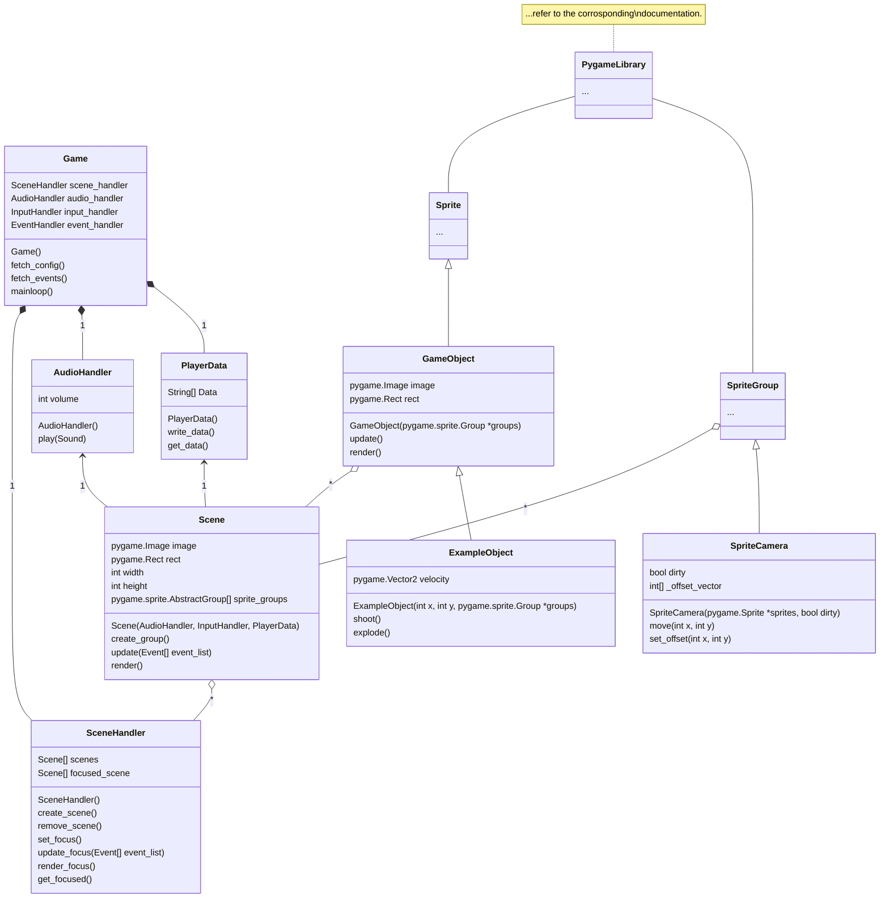

# Minesweeper

Python 3.10, Pygame 2.1.2

Systems to implement:

- Dedicated input handler

        - Review
        - Implement

- Dedicated event handler

        - Review
        - Implement

- Particle system

---
## UML Class Diagram (unfinished)
I suck at UML diagrams so bare with me.

